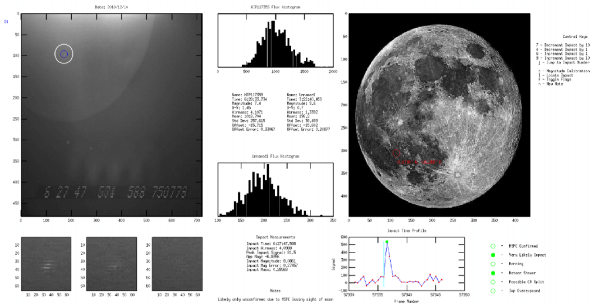
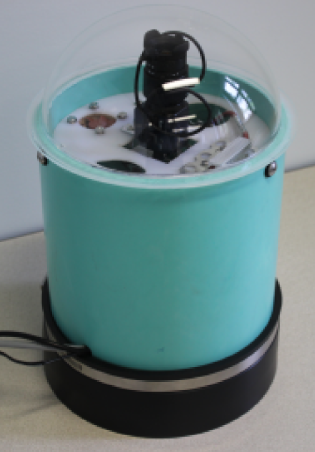
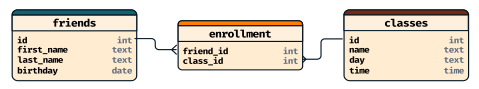

## Talk Structure
- Background: How did I get here?
    - Introduction
    - Past research
- What are databases?
    - Basics
    - Compare and contrast to spreadsheets
- Installation and Use
    - Options: from simple to complex
    - Interfaces
- Examples
- Summary

# Background: How did I get here?

## Summary


## Grad Research
::::::{.cols style='align-items:center'}
::::col
- My graduate research centered around refining our estimates of the mass distribution of the near-Earth asteroid population
- Too small to be detected by most means, my detection screen was the shadowed portion of the moon
- Involved _many_ nights of observations
    - As commonly happens, the amount of data snuck up on me
::::

::::col


::::
::::::

## Tracking Observations




## Willamette Research
::::::cols
::::col
- Cloudy skies makes lunar observations impractical
- What if Earth's skies became the "detection screen" instead?
    - Any part of the sky being clear could allow for observations
    - Need an automated recording system
- Detection analysis done onboard with a microcomputer
- The data load _still_ crept up on me! Despite more efforts!
::::

::::col

::::
::::::


## Currently
- Upon joining the SCIS faculty, I took on all the database and data management courses
    - I've taught the undergrad DATA 351 course twice
    - I've taught the graduate DATA 503 course three times, soon to be 5 this spring
- I continue to teach the introductory programming courses in Python, and run the Section Leader program
- I teach courses that lie at the intersection of the natural sciences and data science, currently Data in the Cosmos

# What is a Database?

## A Family
- There are actually a variety of types of databases, each with their tradeoffs
    - Relational databases
    - Document databases
    - Graph databases
- For those coming from familiarity with spreadsheets, relational databases will probably feel the more intuitive
- Relational databases also happen to still be incredibly popular in industry

## Why Relational Tables?
- Suppose you wanted to keep track of your friends birthdays
    - This could easily be accomplished in a single table

| First Name | Last Name | Birthday
| ---        | ---       | ---
| Frank      | Stein     | 4/2/2000
| Tessa      | Loch      | 8/23/2003
| Bobby      | Wolf      | 12/14/2005

## Complicating Things
- What if you also wanted to track what classes each friend was taking?
- Could imagine each friend taking 2-3 classes, some of which overlap
- This complicates things more than might be expected, since to still store this in a single simple table now requires data duplication

## Classy Friends

First Name | Last Name | Birthday | Class | Class Day | Class Time
---|---|--- |---|---|---
Frank | Stein | 4/2/2000 | CS151 | MWF | 1:00pm
Frank | Stein | 4/2/2000 | MATH256 | MWF | 9:00am
Tessa | Loch | 8/23/2003 | CS151 | MWF | 1:00pm
Tessa | Loch | 8/23/2003 | IDS236 | TTh | 1:00pm
Tessa | Loch | 8/23/2003 | HIST123 | MWF | 12:00pm
Bobby | Wolf | 12/14/2005 | IDS236 | TTh | 1:00pm
Bobby | Wolf | 12/14/2005 | MATH256 | MWF | 9:00am

<p style="text-align: center; color: var(--red); font-weight: bold;" class="fragment">Data Duplication = BAD</p>

## Relational Tables
- One solution to this issue is realizing that we are trying to actually keep track of two things: friends and classes.
- So we break things up into _two_ tables, and then create relationships between them
- This is the core of what occurs in a _relational database_!


::::::{.cols style='align-items: center'}
::::{.col style="font-size:.8em;"}

First Name | Last Name | Birthday
---|---|---
Frank | Stein | 4/2/2000
Tessa | Loch | 8/23/2003
Bobby | Wolf | 12/14/2005

::::

::::{.col style="font-size:.8em"}

Class | Day | Time
---|---|---
CS151 | MWF | 1:00pm
MATH256 | MWF | 9:00am
IDS236 | TTh | 1:00pm
HIST123 | MWF | 12:00pm
PHYS221 | MWF | 10:00pm

::::
::::::


## Viewing Relational Databases
- In general, you'd probably use a third table to represent all the linkages
- Unique id keys are used to connect the different tables

<br>

{width=90%}

## Differences from Spreadsheets
- Databases have a much more rigid structure
    - You define up front what columns you want, **and** the data type associated with that column
    - Each row represents a record or observation, and data is entered one row at a time.
- Calculations are generally done through a query, not stored in cells within the table
    - Eliminates any confusion between the original data and derived values
- Only the data matters. There is no coloring or other formatting.
    - Visualizations are handled by external tools

## Benefits over spreadsheets
- Data Integrity
    - Columns enforce types, calculations can not be mistaken for data, relationships between tables enforced
- Far better performance for huge numbers of records
- Database servers are build for multi-user access, facilitating sharing of data and with full user access control and permissions
- More effective at eliminating duplicate information, and the possible issues that arise
- Excellent support from all popular coding languages for accessing database information
- Separates where the data is stored from where it is analyzed

## SQL
- Pronounced "ESS-QUE-ELL", or, historically "sequel", SQL is the dominant language for interacting with relational databases
- A declarative language, so fairly straightforward to learn
- Primarily used for managing the database, adding records to the database, or extracting specific information from the database

```sql
SELECT columns
FROM table_name
WHERE condition_is_true
ORDER BY column;
```


# Installation and Use

## The Spice of Life
- Relational databases come in a surprisingly large variety of forms and formats
- Many are free and/or open source
- All use a core set of standard SQL, and then start to branch from there
    - Extra functions that are made available
    - Different data types available for columns
- Options can be overwhelming, but we'll cover a few common cases

## Easiest: SQLite
- SQLite stores each database in a _single file_
    - This can make sharing or moving around the database very simple, as people are well acquainted with working with files
- Installation is simple, or even unnecessary, as the tools for creating, managing, and accessing the database are just bundled in a zip file
    - Files available [here](https://www.sqlite.org/download.html)!
- Documentation on website is good
- Many programming languages can interface with SQLite databases
- Simple nature and easy installation make it a great starting point

## Local Server
- Most other database installations operate on a server model
    - The server operates as the central hub that clients can connect to to interact with the database
    - Nothing special about the server aside from it needing to be powered on in order for the data to be accessible
- Could install on a personal system or on a lab or other public system if you want easy access from multiple individuals
- The big players here include PostgreSQL, MySQL, SQL Server, and Oracle
    - I've been teaching PostgreSQL in class and been very happy
        - Installation is more involved, but still not overly complex through EDB [here](https://www.enterprisedb.com/downloads/postgres-postgresql-downloads) or through Postgres.app [here](https://postgresapp.com/) for Mac users

## Remote Server
- If a local server install is too intimidating, or you don't have a good computer to use as a server, there is no shortage of online deployment options as well, though they come with a cost
- The tech giants have offerings through Azure, AWS, or Google Cloud Platform, but I've found them to be overly complicated for most individual or small group needs
- My favorite recommendation for the past year has been [Railway.app](https://railway.app/), though it is not quite as free now as it once was
    - [Digital Ocean](https://www.digitalocean.com/products/managed-databases-postgresql) also has super simple setups, though it runs a bit more expensive

## SQL Client
- For any server-based database (though they tend to work with SQLite as well), you need a client to connect to, view, and run SQL code against the database
- The list of possible clients is massive and can vary between operating systems
- Many are capable of connecting to most of the different database server options
- My favorite at the moment is [Beekeeper Studio (Community Edition)](https://github.com/beekeeper-studio/beekeeper-studio/releases/tag/v4.0.3)
- Another popular client that will connect to most anything is [DBeaver](https://dbeaver.io/)
- Most any client will let you browse table, make edits directly in tables, or run SQL to otherwise manage the database

## NocoDB
:::{style='font-size:.8em'}
- While most SQL clients will show a grid view of a table and may allow edits, they aren't really intended for that to be the main method of interaction
- If you want to leverage the benefits of a database while still leveraging the comfort of a spreadsheet, some options exist
    - [Airtable](https://www.airtable.com/) is a popular option that streamlines working with a database for non-coding folks. Free small plans exist.
    - [NocoDB](https://nocodb.com/) is an open-source offering that I came across recently which aims to mimic much of what has made Airtable so popular
- Either option can connect to an internal database or to an external, already existing database
- Both can significantly simplify allowing multiple users to edit the database, or provide read-only views to certain viewers
- Both also allow the creation of basic forms to streamline entering new information into the database, which otherwise requires some coding knowledge
:::

# Examples

## Polling

## Grades

# Conclusions

## Pros/Cons
::::::cols
::::col
:::{.block name=Databases}
- More robust toward data integrity and organization
- More performant as the amount of data increases
- Able to be easily connected to from a host of other software or programs
- Excellent for storage of accruing data for later analysis
- Do one thing, and do it very well
:::
::::

::::col
:::{.block name=Spreadsheets}
- Are incredibly flexible in being able to store, analyze, and visualize data all at once
- Are more visual to use, requiring no knowledge of a coding language or SQL
- Generally expected to store mainly numbers or text, and can struggle with other data formats
- Perfect for quick analysis of relatively small or uncomplicated datasets
:::
::::
::::::


## Wrapping Up
- Thank you to all of your for attending!
- Hopefully I've at least put the thought in your head that in certain cases databases can be worth the shift
    - They have massively impacted the way I operate (for the better) these past several years.
- Please know that I'm always happy to help advise or assist anyone with database related questions
